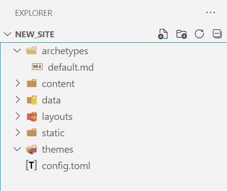
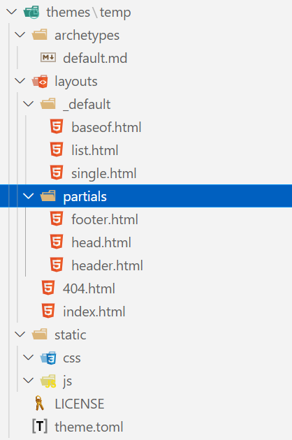
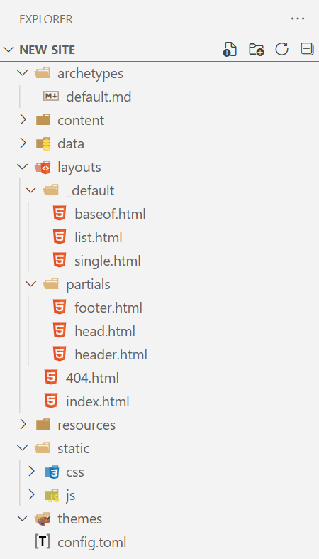

The hardest part of getting started with Hugo is finding a theme which is simple and non-opinionated so that you can learn the ropes.

In this post I will be detailing how you can start the process of creating your own stater template. You will need to have Hugo installed locally for this tutorial.

The first thing you need to do is create a new directory for this project.

Open this new directory up with your favourite code editor and run the command

```console
hugo new site ./
```

This will create a directory structure which looks like the following:



Hugo will provide you with the following feedback:

```console
Congratulations! Your new Hugo site is created in C:\........\new_site.

Just a few more steps and you're ready to go:

1. Download a theme into the same-named folder.
   Choose a theme from https://themes.gohugo.io/ or
   create your own with the "hugo new theme <THEMENAME>" command.
2. Perhaps you want to add some content. You can add single files
   with "hugo new <SECTIONNAME>\<FILENAME>.<FORMAT>".
3. Start the built-in live server via "hugo server".

Visit https://gohugo.io/ for quickstart guide and full documentation.
```

While all of the directories that have been created are empty (except for archetypes), the third line in step 1 will help give us some hints as to what we need to put in the layouts folder.

We won't be creating a theme, but we will create one temporarily so that we can use the boilerplate content structure - and then improve on it.

Go ahead and run

```console
hugo new theme temp
```

And you will get the following directory structure and files



Go ahead and copy the contents of the 'layouts' folder and the 'static' folder into their respective folders in the root directory. You can then go ahead and delete the 'temp' theme folder. You get a structure like this:


